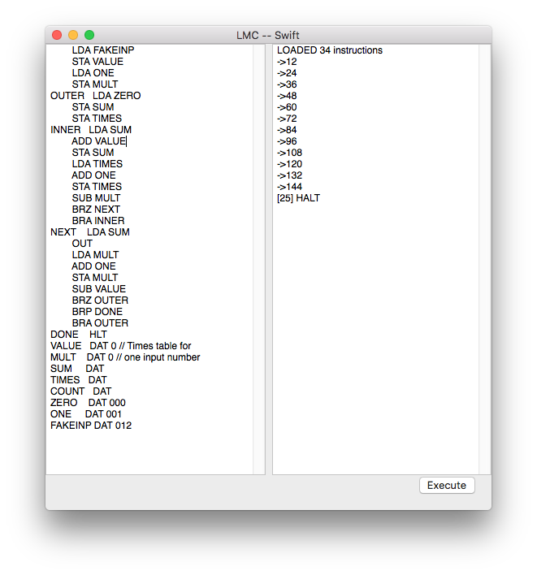

# Swift Little Man Assembler and Interpreter

This is a Swift 4 implementation of the [Little Man Computer](https://en.wikipedia.org/wiki/Little_man_computer) architecture. I wrote this as an extra credit assignment in my Advanced Computer Science and Data Structures class at Colorado Academy.

While the interface isn't pretty, the simulated computer and assembler underneath are very functional. The assembler is forgiving of whitespace, supports comments, and also supports dynamic symbols. The machine code interpreter is fast and supports the entire instruction set. 

The underlying `LMC_Interpreter.swift` is also compatible with Swift Playgrounds on iOS. 